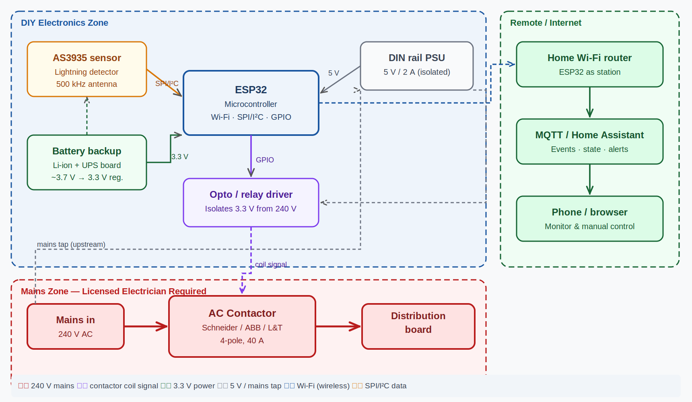
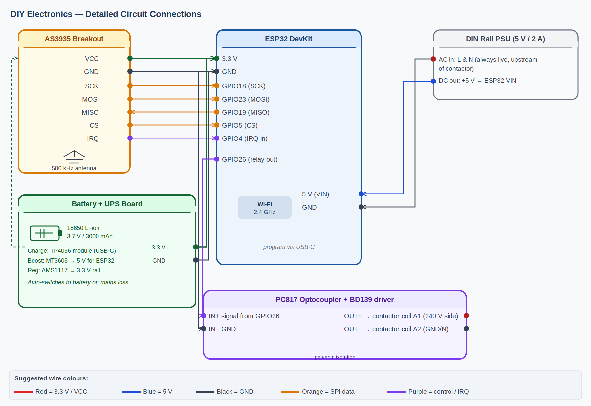
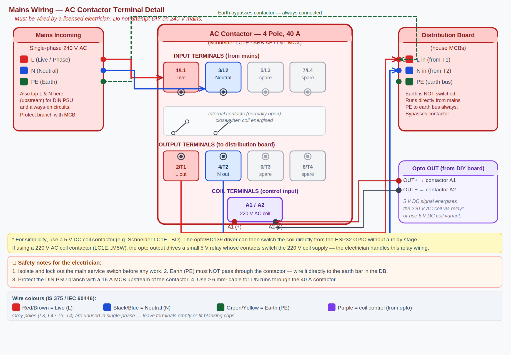

# jigawatt


> I detect lightning. Then I open a contactor. Then I wait, in a damp box, for the next storm. It is not a calling. It is, however, what I do.

A small box that listens for lightning and unhooks the house from the grid before the grid has an opinion about it. Built for the kind of monsoon that does not care what your surge protector claims on the back of the packaging.

Part of the [starstucklab](https://github.com/m-anish/starstucklab) ecosystem. The name is Doc Brown's, mispronounced on purpose.

---

## What it does

- Listens on an AS3935 franklin-type lightning sensor for in-cloud and cloud-to-ground discharges.
- Estimates strike distance in kilometres and rate of approach.
- When a strike is detected within a configured radius, drives a 4-pole 40A AC contactor open, disconnecting all live and neutral lines feeding the house.
- Holds the disconnect for a configurable cool-off window after the last strike, then re-engages.
- Reports state, strike count, distance, RSSI, and battery voltage over MQTT.
- Surfaces all of the above as entities in Home Assistant for dashboards, automations, and the satisfaction of watching a graph spike during a thunderstorm.
- Runs through grid loss on a Li-ion UPS board, because the storm that takes out the mains is the one you most want to be online for.

It does not pretend to be lightning protection. It is a fast, dumb switch with an opinion about timing.

---

## How it works

Three diagrams, in increasing order of "this is where the wires actually go."


*System overview — sensor, controller, MQTT, and the contactor in their natural habitat.*


*Control board — ESP32, AS3935 on SPI, PC817 optocoupler isolating an ESP32 GPIO from a BD139 that drives the contactor coil.*


*Mains side — 4-pole 40A AC contactor between the incoming supply and the household distribution board, with the UPS feeding the low-voltage side independently.*

> The public site is at **[jigawatt.starstucklab.com](https://jigawatt.starstucklab.com)** — it's the marketing version, treating unit 001 like a launch. This README is the engineering version.

The ESP32 keeps the contactor coil energised in normal operation. A detected strike de-energises the coil; the contactor falls open under its own spring. Failure of the controller, the optocoupler, or the supply to the coil therefore also opens the contactor. This is deliberate.

---

## Hardware

| Item | Qty | Approx. cost (INR) |
|---|---|---|
| AS3935 lightning sensor module (SPI) | 1 | 850 |
| ESP32 DevKit v1 | 1 | 450 |
| 4-pole 40A AC contactor (230V coil) | 1 | 1,100 |
| PC817 optocoupler | 1 | 10 |
| BD139 NPN transistor | 1 | 15 |
| 1N4007 flyback diode | 1 | 5 |
| Resistors, capacitors, headers | — | 100 |
| Li-ion UPS board (5V, 18650-based) | 1 | 750 |
| 18650 Li-ion cell, 3000mAh | 2 | 500 |
| 5V / 230V isolated AC-DC module (Hi-Link or similar) | 1 | 350 |
| IP65 polycarbonate enclosure | 1 | 700 |
| DIN rail terminals, ferrules, lugs, wire | — | 400 |
| Perfboard / custom PCB | 1 | 250 |
| **Total** |  | **~5,480** |

Costs are indicative, sourced locally in India in May 2026, and exclude what you will inevitably break.

---

## Wiring

AS3935 to ESP32, over SPI:

| AS3935 pin | ESP32 GPIO | Notes |
|---|---|---|
| VCC | 3V3 | Do not feed this from 5V. |
| GND | GND | — |
| SCK | GPIO 18 | SPI clock (VSPI default) |
| MISO | GPIO 19 | SPI MISO |
| MOSI | GPIO 23 | SPI MOSI |
| CS | GPIO 5 | Active low |
| IRQ | GPIO 4 | Interrupt on strike / noise / disturber |

Contactor coil driver:

| Signal | ESP32 GPIO | Notes |
|---|---|---|
| Coil drive | GPIO 16 | Drives PC817 LED through a 1k series resistor; PC817 transistor switches BD139 base; BD139 collector switches the contactor coil. Flyback diode across the coil. Coil supply is fully isolated from the ESP32 rail. |

Status:

| Signal | ESP32 GPIO |
|---|---|
| Heartbeat LED | GPIO 2 |
| Reset button | EN |

---

## Getting started

### Firmware

Built with PlatformIO and the Arduino framework for ESP32. From the repo root:

```bash
cd firmware
cp config.example.h config.h     # set Wi-Fi, MQTT, and thresholds
pio run -t upload                 # flash the ESP32
pio device monitor                # watch it boot
```

Key settings in `config.h`:

- `STRIKE_DISTANCE_KM` — open the contactor when strikes are detected within this distance. Default: 10.
- `COOL_OFF_SECONDS` — hold the disconnect for this many seconds after the last qualifying strike. Default: 300.
- `INDOOR_MODE` — `true` if the AS3935 is enclosed in metal or near other electronics. Adjusts the gain register.
- `NOISE_FLOOR`, `WATCHDOG_THRESHOLD`, `SPIKE_REJECTION` — AS3935 tuning. Start with defaults; tune against your local noise environment.

### MQTT

Set broker address, port, username, password, and base topic in `config.h`. The firmware publishes:

| Topic | Payload | Retained |
|---|---|---|
| `jigawatt/state` | `armed` / `tripped` / `cooling` / `fault` | yes |
| `jigawatt/strike` | JSON: `{distance_km, energy, ts}` | no |
| `jigawatt/strike_count` | integer, since boot | yes |
| `jigawatt/contactor` | `closed` / `open` | yes |
| `jigawatt/battery_v` | float | yes |
| `jigawatt/rssi` | int (dBm) | yes |
| `jigawatt/availability` | `online` / `offline` (LWT) | yes |

It subscribes to:

| Topic | Payload | Effect |
|---|---|---|
| `jigawatt/cmd/arm` | `1` | Force re-engage after a trip. |
| `jigawatt/cmd/test` | `1` | Simulate a strike for testing. |
| `jigawatt/cmd/reboot` | `1` | Reboot the ESP32. |

### Home Assistant

MQTT discovery is enabled. Once the broker is configured and the device is online, a `jigawatt` device appears in **Settings → Devices & Services → MQTT** with sensors for state, last strike distance, strike count, contactor position, battery voltage, and signal strength, plus buttons for arm, test, and reboot.

A reference Lovelace card and a sample automation (notify on first strike within 20 km, log every trip) are in `docs/home_assistant/`.

---

## Project status

Brooding. Functional, deployed at one site, and quietly accumulating data through a monsoon. PCB version pending. Documentation will improve when the rain stops.

---

<sub>A [starstucklab](https://github.com/m-anish/starstucklab) project — building small machines for an indifferent universe.</sub>
